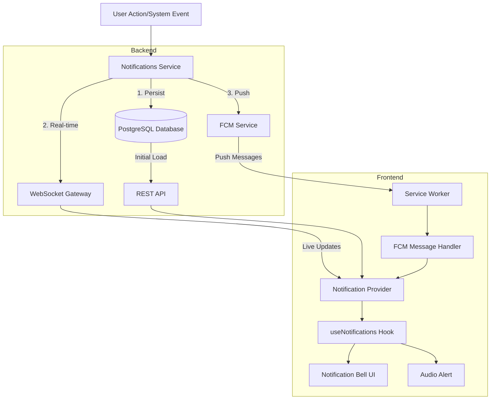
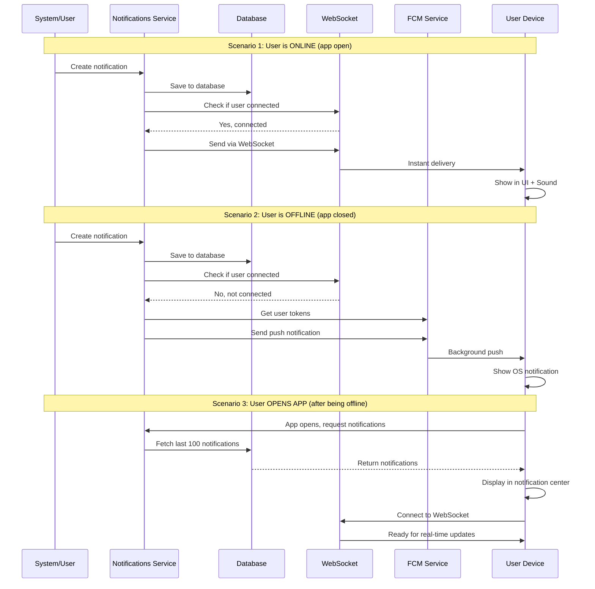

# Complete Notification System Implementation

## Overview

Build a unified, real-time notification system for all user types using **three notification channels**:

1. **DATABASE (PostgreSQL)** - Persistent storage, source of truth
2. **WEBSOCKET** - Real-time delivery when app is open
3. **FCM (Firebase Cloud Messaging)** - Push notifications when app is closed

The system intelligently selects channels based on user connection state, prevents duplicates, and ensures reliable notification delivery across all scenarios.

## Current State Analysis

### Backend (✅ Complete)

- [`apps/backend/src/modules/notifications/notifications.service.ts`](apps/backend/src/modules/notifications/notifications.service.ts) - Multi-channel service
- [`apps/backend/src/modules/notifications/notifications.controller.ts`](apps/backend/src/modules/notifications/notifications.controller.ts) - REST endpoints
- [`apps/backend/src/modules/notifications/notifications.gateway.ts`](apps/backend/src/modules/notifications/notifications.gateway.ts) - WebSocket gateway
- Database schema and 50 notification types ready

### Frontend Issues

- ❌ Regular users have **hardcoded static notifications** in [`apps/web/components/navigation/navbar.tsx`](apps/web/components/navigation/navbar.tsx) (lines 76-118)
- ❌ No user WebSocket integration (only admin has it)
- ❌ `useNotifications()` hook exists but unused
- ✅ Admin system is complete

## Architecture: Three-Channel Notification System

### FCM + DATABASE + WEBSOCKET Integration



### How the Three Channels Work Together

1. **DATABASE Channel (Persistence)**

   - All notifications saved to PostgreSQL
   - Source of truth for notification history
   - Loaded on app mount (last 100 notifications)
   - Supports pagination and search

2. **WEBSOCKET Channel (Real-time, App Open)**

   - Instant delivery when user is online with app open
   - Bidirectional communication
   - Handles: new notifications, read status updates, deletions
   - Reconnects automatically if disconnected

3. **FCM Channel (Push, App Closed/Background)**

   - Delivers notifications when app is closed or in background
   - Works across devices (web, mobile)
   - Service worker handles background messages
   - Clicking notification opens app and marks as read

### Channel Selection Logic

```
User creates notification:
├─ Always: Save to DATABASE
├─ If user online in app: Send via WEBSOCKET
├─ If user offline or app closed: Send via FCM
└─ Backend decides based on user connection status
```

### Notification Flow Scenarios



## Implementation Plan

### Phase 1: Backend Enhancements

#### 1.1 Update WebSocket Gateway

**File:** [`apps/backend/src/modules/notifications/notifications.gateway.ts`](apps/backend/src/modules/notifications/notifications.gateway.ts)

**Changes:**

- Add regular user subscription handling (currently only admin-focused)
- Add `subscribe:user` event handler for non-admin users
- Ensure `sendNotification(userId, notification)` works for all user types
- Add user-specific rooms: `user-${userId}`

**Current code** (lines 53-62):

```typescript
@SubscribeMessage('subscribe')
handleSubscribe(
  @ConnectedSocket() client: Socket,
  @MessageBody() data: { userId: number; roles?: string[] }
) {
  client.join(`user-${data.userId}`);
  // ...
}
```

**Enhancement needed:**

- Verify this works for all user types
- Add notification type filtering per user preferences

#### 1.2 Add Bulk Read/Delete Endpoints

**File:** [`apps/backend/src/modules/notifications/notifications.controller.ts`](apps/backend/src/modules/notifications/notifications.controller.ts)

**Add endpoints:**

- `GET /notifications/unread-count` - Get unread notification count
- `POST /notifications/mark-all-read` - Already exists ✅
- `DELETE /notifications/bulk-delete` - Delete multiple notifications
- `GET /notifications/types` - Get available notification types for filtering

#### 1.3 Enhance Notifications Service

**File:** [`apps/backend/src/modules/notifications/notifications.service.ts`](apps/backend/src/modules/notifications/notifications.service.ts)

**Add methods:**

- `getUnreadCount(userId: number)`
- `bulkDelete(notificationIds: number[])`
- `getNotificationTypes()` - Return notification types for UI filtering

#### 1.4 FCM Token Management (Backend)

**File:** `apps/backend/src/modules/notifications/fcm-tokens.service.ts` (NEW)

**Purpose:**

- Store FCM device tokens per user
- Support multiple devices per user
- Handle token refresh and expiration
- Clean up stale tokens

**Database table needed:**

```sql
CREATE TABLE fcm_tokens (
  id BIGSERIAL PRIMARY KEY,
  user_id BIGINT REFERENCES users(id),
  token TEXT UNIQUE NOT NULL,
  device_type VARCHAR(20), -- 'web', 'android', 'ios'
  device_info JSONB,
  created_at TIMESTAMP DEFAULT NOW(),
  last_used_at TIMESTAMP DEFAULT NOW(),
  is_active BOOLEAN DEFAULT true
);
```

**API Endpoints (add to controller):**

- `POST /notifications/fcm/register` - Register/update FCM token
- `DELETE /notifications/fcm/unregister` - Remove FCM token
- `GET /notifications/fcm/devices` - List user's registered devices

### Phase 2: Frontend Core Infrastructure

#### 2.1 Create Unified Notification Hook

**File:** `apps/web/lib/hooks/use-notifications.ts` (NEW)

**Features:**

- WebSocket connection for real-time updates
- Initial load from backend API on mount
- State management for notifications
- Mark as read (single/all)
- Delete (single/bulk)
- Filter by type
- Unread count tracking
- Sound alerts on new notification
- Auto-reconnect logic

**Key methods:**

```typescript
{
  notifications: Notification[];
  unreadCount: number;
  connected: boolean;
  loading: boolean;
  markAsRead: (id: number) => Promise<void>;
  markAllAsRead: () => Promise<void>;
  deleteNotification: (id: number) => Promise<void>;
  clearAll: () => Promise<void>;
  filterByType: (type?: string) => void;
  playSound: boolean;
  toggleSound: () => void;
}
```

**Sync strategy:**

1. On mount: Load last 100 notifications from API
2. Connect to WebSocket
3. Subscribe to user-specific room
4. New notifications arrive via WebSocket → prepend to list → play sound
5. Mark as read → optimistic update + API call
6. If WebSocket disconnects → show offline badge, queue actions

#### 2.2 Create Notification Provider

**File:** `apps/web/lib/contexts/notification-context.tsx` (NEW)

**Purpose:**

- Wrap the notification hook in a React Context
- Make notifications accessible throughout the app
- Handle authentication state changes
- Manage WebSocket lifecycle

#### 2.3 Create Sound Alert System

**Files:**

- `apps/web/public/sounds/notification.mp3` (asset)
- `apps/web/lib/utils/notification-sound.ts` (utility)

**Features:**

- Play sound on new notification (if enabled)
- Respect browser notification permissions
- Mute/unmute toggle
- Different sounds for different notification types (optional)

### Phase 3: Frontend UI Components

#### 3.1 Create Unified Notification Center Component

**File:** `apps/web/components/shared/notification-center.tsx` (NEW)

**Features:**

- Replaces both admin and user notification UIs
- Bell icon with unread badge
- Dropdown panel (Popover)
- Tabs: All / Unread
- Filter by notification type dropdown
- Mark as read (individual)
- Mark all as read button
- Delete notification button
- Clear all button
- Sound toggle button
- Timestamp with relative time
- Click notification → navigate to link → mark as read
- Empty states
- Loading states
- Offline indicator

**UI Structure:**

```
┌─────────────────────────────┐
│ Notifications [Sound🔔]     │
│ [Mark All] [Filter▼] [Clear]│
├─────────────────────────────┤
│ [All] [Unread]              │
├─────────────────────────────┤
│ 🎓 Course Enrollment        │
│    You enrolled in React... │
│    5 mins ago [✓] [×]       │
├─────────────────────────────┤
│ 💬 New Comment              │
│    Jane replied to your...  │
│    2 hours ago [✓] [×]      │
└─────────────────────────────┘
```

#### 3.2 Update Navbar Component

**File:** [`apps/web/components/navigation/navbar.tsx`](apps/web/components/navigation/navbar.tsx)

**Changes:**

- Remove hardcoded notification UI (lines 76-118)
- Import and use new `NotificationCenter` component
- Remove `children` prop pattern (use same component for all users)
- Ensure admin users still see admin-specific notifications

**Before (lines 76-118):**

```typescript
{children ? children : (
  <DropdownMenu>
    // Hardcoded static notifications
  </DropdownMenu>
)}
```

**After:**

```typescript
<NotificationCenter />
```

#### 3.3 Update Admin Layout

**File:** [`apps/web/app/(admin)/admin-layout-client.tsx`](apps/web/app/\\\\\\\\\\\\\\(admin)/admin-layout-client.tsx)

**Changes:**

- Remove admin-specific `WebSocketProvider` wrapper
- Remove `<NotificationCenter />` from Navbar children
- Use unified notification system

#### 3.4 Integrate Notification Provider

**File:** [`apps/web/app/providers.tsx`](apps/web/app/providers.tsx)

**Changes:**

- Add `NotificationProvider` to provider stack
- Place after `SessionProvider` (needs auth)
- Place before UI components

**Update structure:**

```typescript
<SessionProvider>
  <QueryClientProvider>
    <AuthProvider>
      <NotificationProvider> {/* NEW */}
        <RBACProvider>
          {children}
        </RBACProvider>
      </NotificationProvider>
    </AuthProvider>
  </QueryClientProvider>
</SessionProvider>
```

### Phase 4: Integration & Features

#### 4.1 Notification Type Filtering

**Files:**

- `apps/web/components/shared/notification-center.tsx`
- `apps/web/lib/hooks/use-notifications.ts`

**Implementation:**

- Fetch notification types from backend
- Add dropdown filter in UI
- Filter notifications client-side
- Persist filter preference in localStorage

**Filter options:**

- All Notifications
- Courses (enrollments, completions)
- Social (comments, likes, follows)
- Jobs (applications, offers)
- Payments (receipts, refunds)
- System (updates, maintenance)

#### 4.2 Sound Alerts

**Files:**

- `apps/web/lib/utils/notification-sound.ts`
- `apps/web/lib/hooks/use-notifications.ts`

**Implementation:**

- Add sound file to `/public/sounds/`
- Create audio utility with play method
- Trigger on new WebSocket notification
- Add mute toggle in notification panel
- Persist mute preference in localStorage
- Check notification permissions

#### 4.3 Delete Functionality

**Backend:**

- Add soft delete (set `isDeleted: true`)
- Filter out deleted notifications in queries

**Frontend:**

- Delete button (X) on each notification
- Optimistic update (remove from UI immediately)
- API call to persist deletion
- Rollback if API fails

#### 4.4 Offline Handling

**Features:**

- Show "Offline" badge when WebSocket disconnected
- Queue actions (mark as read, delete) when offline
- Retry queued actions on reconnect
- Show error toast if action fails

### Phase 5: FCM (Firebase Cloud Messaging) Integration

#### 5.1 FCM Message Handler (Frontend)

**File:** `apps/web/lib/firebase/fcm-handler.ts` (NEW)

**Purpose:**

- Handle foreground FCM messages (when app is open)
- Handle background FCM messages (via service worker)
- Sync FCM notifications with notification state
- Show browser notifications

**Key features:**

```typescript
class FCMHandler {
  // Request permission and get token
  async requestPermission(): Promise<string | null>;
  
  // Handle foreground messages
  onForegroundMessage(callback: (notification) => void);
  
  // Register token with backend
  async registerToken(token: string): Promise<void>;
  
  // Unregister token
  async unregisterToken(token: string): Promise<void>;
  
  // Refresh token if expired
  async refreshToken(): Promise<string | null>;
}
```

**Integration points:**

- Call from `NotificationProvider` on mount
- Listen for FCM messages and add to notification state
- Show browser notification if app is not focused

#### 5.2 Update Service Worker

**File:** [`apps/web/public/firebase-messaging-sw.js`](apps/web/public/firebase-messaging-sw.js)

**Current state:** Basic FCM setup exists

**Enhancements needed:**

- Handle notification clicks → open app to specific URL
- Store notification in IndexedDB for sync when app opens
- Show rich notifications with images and actions
- Handle notification actions (Mark as Read, Dismiss)

**Example handler:**

```javascript
// Handle background messages
self.addEventListener('push', (event) => {
  const data = event.data.json();
  
  event.waitUntil(
    self.registration.showNotification(data.notification.title, {
      body: data.notification.body,
      icon: '/icon-192x192.png',
      badge: '/badge-72x72.png',
      data: data.data,
      actions: [
        { action: 'open', title: 'View' },
        { action: 'dismiss', title: 'Dismiss' }
      ]
    })
  );
});

// Handle notification clicks
self.addEventListener('notificationclick', (event) => {
  event.notification.close();
  
  if (event.action === 'open') {
    const url = event.notification.data.linkUrl || '/hub/notifications';
    clients.openWindow(url);
  }
});
```

#### 5.3 Integrate FCM with Notification Provider

**File:** `apps/web/lib/contexts/notification-context.tsx`

**Integration:**

1. Initialize FCM handler on provider mount
2. Request notification permission
3. Register FCM token with backend
4. Listen for FCM messages
5. When FCM message arrives:

   - If notification already in state (from WebSocket) → ignore
   - If new notification → add to state
   - Play sound alert
   - Update unread count

**Deduplication logic:**

```typescript
// Prevent duplicate notifications from WebSocket + FCM
const addNotification = (notification) => {
  setNotifications(prev => {
    const exists = prev.some(n => n.id === notification.id);
    if (exists) return prev;
    return [notification, ...prev];
  });
};
```

#### 5.4 FCM Token Lifecycle Management

**File:** `apps/web/lib/hooks/use-fcm.ts` (NEW)

**Responsibilities:**

- Request permission on user login
- Get FCM token
- Register token with backend
- Refresh token if changed
- Unregister token on logout
- Handle permission denied state

**Usage in provider:**

```typescript
const { token, permission, requestPermission } = useFCM();

useEffect(() => {
  if (session?.user && permission === 'granted' && token) {
    registerTokenWithBackend(token);
  }
}, [session, token, permission]);
```

#### 5.5 Backend FCM Logic Enhancement

**File:** [`apps/backend/src/modules/notifications/notifications.service.ts`](apps/backend/src/modules/notifications/notifications.service.ts)

**Enhance `sendMultiChannelNotification` method:**

Currently sends to all channels. Update to be smarter:

```typescript
async sendMultiChannelNotification(data: MultiChannelNotificationData) {
  // 1. Always save to DATABASE
  const dbNotification = await this.create({...});
  
  // 2. Check if user is connected via WebSocket
  const isConnected = this.notificationsGateway.isUserConnected(userId);
  
  if (isConnected) {
    // User is online → send via WEBSOCKET only
    this.notificationsGateway.sendNotification(userId, {...});
  } else {
    // User is offline → send via FCM
    const fcmTokens = await this.fcmTokensService.getUserTokens(userId);
    for (const token of fcmTokens) {
      await this.fcmService.sendNotification(token, title, message, data);
    }
  }
  
  // 3. Email (if enabled in preferences)
  if (channels.includes('email') && preferences.emailEnabled) {
    // Send email...
  }
}
```

**Add to gateway:**

```typescript
// Check if user is connected
isUserConnected(userId: number): boolean {
  return Array.from(this.connectedClients.values())
    .some(client => client.userId === userId);
}
```

### Phase 6: Testing & Polish

#### 6.1 Type Definitions

**File:** `apps/web/types/notification.ts` (NEW)

**Define:**

```typescript
interface Notification {
  id: number;
  userId: number;
  notificationTypeId: number;
  type: string;
  title: string;
  message: string;
  linkUrl?: string;
  isRead: boolean;
  createdAt: Date;
  readAt?: Date;
}

interface NotificationFilter {
  type?: string;
  unreadOnly: boolean;
}
```

#### 6.2 Error Handling

- WebSocket connection failures
- API request failures
- Invalid notification data
- Rate limiting
- Token expiration

#### 6.3 Performance Optimization

- Virtualize long notification lists
- Debounce mark-as-read API calls
- Batch delete operations
- Limit initial load to 100 notifications
- Implement pagination for "View All" page

#### 6.4 Accessibility

- ARIA labels for notification count
- Keyboard navigation in dropdown
- Screen reader announcements for new notifications
- Focus management

## Key Technical Decisions

### 1. Three-Channel Architecture (FCM + DATABASE + WEBSOCKET)

**Channel Selection Logic:**

```
Backend determines channel based on user state:
├─ DATABASE: Always persist (source of truth)
├─ WEBSOCKET: Send if user is actively connected
└─ FCM: Send if user is offline or app is closed
```

**Why this approach?**

- Prevents duplicate notifications
- Reduces FCM quota usage
- Faster delivery via WebSocket when possible
- Falls back to FCM for reliability

### 2. Deduplication Strategy

**Problem:** User might receive same notification via WebSocket AND FCM

**Solution:**

- Each notification has unique ID from database
- Frontend deduplicates by notification ID
- If notification already in state → ignore
- WebSocket takes priority over FCM (faster)

### 3. Sync Strategy (WebSocket-Primary)

- **Initial load:** Fetch last 100 from DATABASE via API
- **Real-time:** WebSocket for new notifications (app open)
- **Background:** FCM push notifications (app closed)
- **Fallback:** If WebSocket fails, fall back to 30s polling
- **Reconciliation:** On reconnect, fetch missed notifications by timestamp

### 4. State Management

- React Context + hooks (no Redux)
- Single source of truth for notifications
- Optimistic updates for better UX
- Local state syncs with API

### 5. Component Reusability

- Single `NotificationCenter` for all user types
- Differentiate admin vs user via notification types
- No separate admin component needed

### 6. FCM Token Management

- Store multiple tokens per user (multi-device support)
- Token stored in backend database
- Auto-refresh expired tokens
- Clean up stale tokens (>30 days unused)

### 7. Sound Alerts

- Use Web Audio API
- Play on WebSocket OR FCM message
- Respect browser autoplay policies
- User can mute via toggle
- Only play when tab is active

## Files to Create/Modify

### New Files (12)

**Backend (2):**

1. `apps/backend/src/modules/notifications/fcm-tokens.service.ts` - FCM token management
2. `packages/database/src/schema/fcm-tokens.schema.ts` - FCM tokens database schema

**Frontend (10):**

1. `apps/web/lib/hooks/use-notifications.ts` - Main notification hook (WebSocket + API)
2. `apps/web/lib/hooks/use-fcm.ts` - FCM token and permission management
3. `apps/web/lib/contexts/notification-context.tsx` - React Context provider
4. `apps/web/lib/firebase/fcm-handler.ts` - FCM message handler
5. `apps/web/components/shared/notification-center.tsx` - Unified UI component
6. `apps/web/lib/utils/notification-sound.ts` - Sound alert utility
7. `apps/web/types/notification.ts` - TypeScript type definitions
8. `apps/web/public/sounds/notification.mp3` - Notification sound asset
9. `apps/web/app/(hub)/hub/notifications/page.tsx` - Full notifications page (optional)
10. `apps/web/lib/utils/notification-deduplicator.ts` - Deduplicate WebSocket + FCM

### Modified Files (8)

**Backend (3):**

1. `apps/backend/src/modules/notifications/notifications.gateway.ts` - Add user connection tracking
2. `apps/backend/src/modules/notifications/notifications.controller.ts` - Add FCM and bulk endpoints
3. `apps/backend/src/modules/notifications/notifications.service.ts` - Smart channel selection logic

**Frontend (5):**

1. `apps/web/public/firebase-messaging-sw.js` - Enhanced service worker for FCM
2. `apps/web/components/navigation/navbar.tsx` - Use real NotificationCenter
3. `apps/web/app/providers.tsx` - Add NotificationProvider
4. `apps/web/app/(admin)/admin-layout-client.tsx` - Remove admin-specific provider
5. `apps/web/lib/firebase/config.ts` - Enhance FCM configuration (if needed)

## Success Criteria

### Core Functionality

- ✅ All users (students, instructors, admins) see real-time notifications
- ✅ Notifications persist in DATABASE (PostgreSQL)
- ✅ Notifications load from backend API on mount (last 100)
- ✅ New notifications arrive instantly via WEBSOCKET (app open)
- ✅ Push notifications delivered via FCM (app closed/background)
- ✅ No duplicate notifications (WebSocket + FCM deduplication)

### User Actions

- ✅ Users can mark as read (single notification)
- ✅ Users can mark all as read (bulk action)
- ✅ Users can delete individual notifications
- ✅ Users can clear all notifications
- ✅ Users can filter by notification type
- ✅ Click notification → navigate to relevant page

### UX Features

- ✅ Sound alert plays on new notification (with mute toggle)
- ✅ Unread count badge updates in real-time
- ✅ Offline indicator when WebSocket disconnected
- ✅ Action queuing when offline (retry on reconnect)
- ✅ Responsive UI on all screen sizes
- ✅ Accessible (ARIA labels, keyboard navigation)

### FCM Integration

- ✅ Browser notification permission requested on login
- ✅ FCM token registered with backend
- ✅ Background notifications work (app closed)
- ✅ Clicking push notification opens app to correct page
- ✅ Service worker handles background messages
- ✅ Multiple device support per user

### Technical Quality

- ✅ No hardcoded/static notifications
- ✅ Admin notifications still work (via same system)
- ✅ Performance optimized (virtualization, debouncing)
- ✅ Proper error handling and fallbacks
- ✅ TypeScript types for all interfaces
- ✅ Clean code architecture (Context + Hooks)