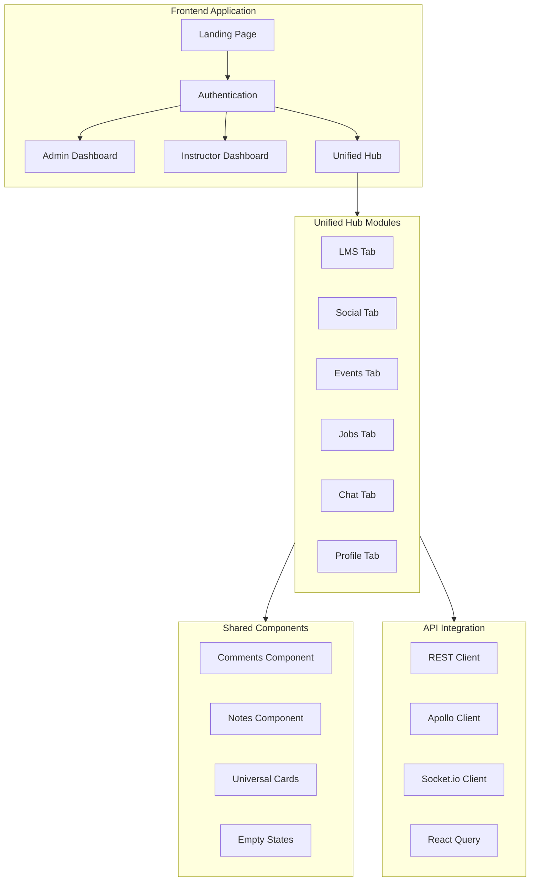

# Complete Web Frontend Implementation Plan

## Latest Updates

**Enhanced with universal action buttons and post creator:**

1. **10 Shared Action Buttons**: Join, Like, Follow, Report, Share, Save, Enroll, Apply, Register, Message
2. **Universal Post Creator**: Context-aware component for timeline, groups, and pages
3. **Enhanced Card Actions**: All cards now use shared buttons for consistency
4. **Improved Reusability**: 30+ reusable components across the entire application

## Architecture Overview

We'll build a comprehensive Next.js 15 frontend with:



## Phase 1: Setup Shadcn UI & Dependencies

**Install Shadcn UI components:**

```bash
cd apps/web
npx shadcn-ui@latest init
npx shadcn-ui@latest add button card input label select textarea
npx shadcn-ui@latest add tabs dialog dropdown-menu sheet sidebar
npx shadcn-ui@latest add table badge avatar separator scroll-area
npx shadcn-ui@latest add toast progress alert navigation-menu
npx shadcn-ui@latest add popover skeleton accordion command
```

**Install additional dependencies:**

```bash
npm install @hookform/resolvers react-hook-form zod
npm install date-fns lucide-react
npm install recharts # For charts/analytics
npm install react-infinite-scroll-component # For infinite scroll
```

**Files to modify:**

- [`apps/web/tailwind.config.ts`](apps/web/tailwind.config.ts) - Shadcn theme configuration
- [`apps/web/components.json`](apps/web/components.json) - Shadcn components config

## Phase 2: API Integration Layer

**Create API client utilities:**

1. **REST API Client** - [`apps/web/lib/api/client.ts`](apps/web/lib/api/client.ts)

   - Axios instance with auth interceptors
   - Error handling and retry logic
   - Type-safe request methods

2. **React Query Setup** - [`apps/web/lib/hooks/use-api.ts`](apps/web/lib/hooks/use-api.ts)

   - Custom hooks for all endpoints
   - Mutations with optimistic updates
   - Cache invalidation strategies
   - Infinite query support for posts/feeds

3. **Socket.io Client** - [`apps/web/lib/socket/client.ts`](apps/web/lib/socket/client.ts)

   - Real-time connection management
   - Event listeners for chat, notifications
   - Reconnection logic

**Key hooks to implement:**

- `useCourses()` - Fetch and manage courses
- `useEnrollments()` - Student enrollments
- `useInfinitePosts()` - Infinite scroll posts
- `useNotifications()` - Real-time notifications
- `useChat()` - Chat messages and rooms
- `useComments(entityType, entityId)` - Universal comments
- `useNotes(entityType, entityId)` - Universal notes

## Phase 3: State Management (Zustand)

**Create global stores:**

1. **Auth Store** - [`apps/web/stores/auth.store.ts`](apps/web/stores/auth.store.ts)
   ```typescript
   interface AuthState {
     user: User | null;
     role: 'admin' | 'instructor' | 'user' | null;
     setUser: (user: User) => void;
     logout: () => void;
   }
   ```

2. **UI Store** - [`apps/web/stores/ui.store.ts`](apps/web/stores/ui.store.ts)
   ```typescript
   interface UIState {
     sidebarOpen: boolean;
     theme: 'light' | 'dark';
     activeTab: string;
   }
   ```

3. **Chat Store** - [`apps/web/stores/chat.store.ts`](apps/web/stores/chat.store.ts)
   ```typescript
   interface ChatState {
     rooms: ChatRoom[];
     activeRoom: string | null;
     messages: Message[];
   }
   ```


## Phase 4: Universal Shared Components

**Create reusable components for ALL modules:**

### 4.1 Universal Card Components

All cards follow the same pattern for consistency:

1. **Course Card** - [`apps/web/components/cards/course-card.tsx`](apps/web/components/cards/course-card.tsx)

   - Props: `course`, `variant` ('grid' | 'list')
   - Thumbnail, title, instructor, rating, price
   - Progress bar for enrolled courses
   - Actions: View, Enroll, Share, Favorite

2. **User Card** - [`apps/web/components/cards/user-card.tsx`](apps/web/components/cards/user-card.tsx)

   - Props: `user`, `variant`, `showActions`
   - Avatar, name, role, bio
   - Actions: Message, Follow, View Profile

3. **Group Card** - [`apps/web/components/cards/group-card.tsx`](apps/web/components/cards/group-card.tsx)

   - Props: `group`, `variant`
   - Cover image, name, member count, privacy
   - Actions: Join, View, Share

4. **Page Card** - [`apps/web/components/cards/page-card.tsx`](apps/web/components/cards/page-card.tsx)

   - Props: `page`, `variant`
   - Logo, name, followers, description
   - Actions: Like, Follow, Share

5. **Event Card** - [`apps/web/components/cards/event-card.tsx`](apps/web/components/cards/event-card.tsx)

   - Props: `event`, `variant`
   - Date badge, title, location, type
   - Actions: Register, Share, Favorite

6. **Job Card** - [`apps/web/components/cards/job-card.tsx`](apps/web/components/cards/job-card.tsx)

   - Props: `job`, `variant`
   - Company logo, title, location, type
   - Actions: Apply, Save, Share

### 4.2 Universal Interaction Components

1. **Comments Component** - [`apps/web/components/shared/comments.tsx`](apps/web/components/shared/comments.tsx)

   - Props: `entityType`, `entityId`, `entityUserId`
   - Works with: courses, lessons, posts, events, jobs
   - Features:
     - Threaded comments (replies)
     - Reactions (like, love, etc.)
     - Edit/delete own comments
     - Real-time updates
     - Pagination/load more

2. **Notes Component** - [`apps/web/components/shared/notes.tsx`](apps/web/components/shared/notes.tsx)

   - Props: `entityType`, `entityId`
   - Works with: courses, lessons
   - Features:
     - Add/edit/delete notes
     - Visibility selector (Private/Public/Instructors)
     - Color coding
     - Pin/archive functionality
     - Like public notes

3. **Reactions Component** - [`apps/web/components/shared/reactions.tsx`](apps/web/components/shared/reactions.tsx)

   - Props: `entityType`, `entityId`, `reactions`
   - Emoji reactions with count
   - Animated reaction picker
   - Show who reacted

4. **Share Modal** - [`apps/web/components/shared/share-modal.tsx`](apps/web/components/shared/share-modal.tsx)

   - Props: `entityType`, `entityId`, `url`
   - Share to: Social media, Email, Copy link
   - Share internally to groups/timeline

5. **Favorite Button** - [`apps/web/components/shared/favorite-button.tsx`](apps/web/components/shared/favorite-button.tsx)

   - Props: `entityType`, `entityId`, `isFavorited`
   - Toggle favorite/bookmark
   - Animated heart icon

### 4.3 Universal Action Buttons

Create reusable action buttons that work across all entities:

1. **Join Button** - [`apps/web/components/buttons/join-button.tsx`](apps/web/components/buttons/join-button.tsx)

   - Props: `entityType` ('group' | 'event'), `entityId`, `isJoined`, `onJoin`, `onLeave`
   - Used in: Groups, Events
   - States: Join, Joined, Pending, Leave
   - Shows loading state during API call
   - Confirmation dialog for leave action

2. **Like Button** - [`apps/web/components/buttons/like-button.tsx`](apps/web/components/buttons/like-button.tsx)

   - Props: `entityType`, `entityId`, `isLiked`, `likeCount`
   - Used in: Posts, Comments, Notes, Pages
   - Animated heart icon
   - Shows like count
   - Optimistic updates

3. **Follow Button** - [`apps/web/components/buttons/follow-button.tsx`](apps/web/components/buttons/follow-button.tsx)

   - Props: `entityType` ('user' | 'page'), `entityId`, `isFollowing`
   - Used in: User profiles, Pages
   - States: Follow, Following, Unfollow
   - Hover effect shows "Unfollow"

4. **Report Button** - [`apps/web/components/buttons/report-button.tsx`](apps/web/components/buttons/report-button.tsx)

   - Props: `entityType`, `entityId`
   - Universal reporting for any content
   - Opens report modal with reasons
   - Used in: Posts, Comments, Jobs, Users, Groups, Pages

5. **Share Button** - [`apps/web/components/buttons/share-button.tsx`](apps/web/components/buttons/share-button.tsx)

   - Props: `entityType`, `entityId`, `url`, `title`
   - Opens ShareModal component
   - Shows share count
   - Copy link feedback (toast)

6. **Save/Bookmark Button** - [`apps/web/components/buttons/save-button.tsx`](apps/web/components/buttons/save-button.tsx)

   - Props: `entityType` ('job' | 'course' | 'event'), `entityId`, `isSaved`
   - Used in: Jobs (Save for later), Courses (Wishlist), Events (Interested)
   - Bookmark icon with filled/outline states

7. **Enroll Button** - [`apps/web/components/buttons/enroll-button.tsx`](apps/web/components/buttons/enroll-button.tsx)

   - Props: `courseId`, `price`, `enrollmentType`, `isEnrolled`
   - Course-specific enrollment
   - Shows price or "Free"
   - States: Enroll Now, Enrolled, Continue Learning
   - Handles payment flow

8. **Apply Button** - [`apps/web/components/buttons/apply-button.tsx`](apps/web/components/buttons/apply-button.tsx)

   - Props: `jobId`, `hasApplied`
   - Job-specific application
   - Opens application form modal
   - States: Apply, Applied, View Application

9. **Register Button** - [`apps/web/components/buttons/register-button.tsx`](apps/web/components/buttons/register-button.tsx)

   - Props: `eventId`, `registrationStatus`
   - Event-specific registration
   - States: Register, Going, Interested, Maybe, Not Going
   - RSVP dropdown with options

10. **Message Button** - [`apps/web/components/buttons/message-button.tsx`](apps/web/components/buttons/message-button.tsx)

    - Props: `userId`, `userName`
    - Opens chat with user
    - Routes to chat page with room
    - Shows online status indicator

### 4.4 Universal Post Creator

**Create Post Component** - [`apps/web/components/shared/create-post.tsx`](apps/web/components/shared/create-post.tsx)

Universal post creation component that adapts to context:

**Props:**

```typescript
interface CreatePostProps {
  context: 'timeline' | 'group' | 'page';
  contextId?: number; // Group ID or Page ID
  placeholder?: string;
  onPostCreated?: (post: Post) => void;
}
```

**Features:**

- Auto-detects posting context (user timeline, group, or page)
- Rich text editor with formatting (bold, italic, lists)
- Media upload (images, videos)
- Visibility selector (Public, Friends, Only Me) - only for timeline
- Post to group/page automatically based on context
- Emoji picker
- Tag friends (optional)
- Real-time preview
- Character count
- Draft saving

**Usage Examples:**

```typescript
// User Timeline
<CreatePost context="timeline" />

// Group Feed
<CreatePost 
  context="group" 
  contextId={groupId}
  placeholder="Share something with the group..."
/>

// Page Feed
<CreatePost 
  context="page" 
  contextId={pageId}
  placeholder="Share an update on your page..."
/>
```

**UI States:**

- Collapsed: Shows avatar + "What's on your mind?"
- Expanded: Full editor with all options
- Loading: Shows spinner during upload/submit
- Success: Closes and shows toast notification

### 4.5 Empty State Components

1. **Empty State** - [`apps/web/components/empty/empty-state.tsx`](apps/web/components/empty/empty-state.tsx)

   - Props: `icon`, `title`, `description`, `action`
   - Reusable for all empty scenarios
   - Optional CTA button

2. **Specific Empty States:**

   - `no-courses.tsx` - "No courses found. Browse our catalog!"
   - `no-posts.tsx` - "No posts yet. Create your first post!"
   - `no-events.tsx` - "No upcoming events."
   - `no-jobs.tsx` - "No jobs match your criteria."
   - `no-enrollments.tsx` - "You haven't enrolled in any courses yet."
   - `no-messages.tsx` - "No messages. Start a conversation!"
   - `no-notifications.tsx` - "You're all caught up!"
   - `no-results.tsx` - "No results found. Try different keywords."

### 4.6 Loading Components

1. **Card Skeleton** - [`apps/web/components/loading/card-skeleton.tsx`](apps/web/components/loading/card-skeleton.tsx)

   - Generic skeleton for all card types
   - Props: `variant` ('grid' | 'list')

2. **Feed Skeleton** - [`apps/web/components/loading/feed-skeleton.tsx`](apps/web/components/loading/feed-skeleton.tsx)

   - For post feeds with multiple cards

3. **Page Loader** - [`apps/web/components/loading/page-loader.tsx`](apps/web/components/loading/page-loader.tsx)

   - Full page loading state
   - Spinner with message

## Phase 5: Navigation Components

**Create navigation system:**

1. **Navbar** - [`apps/web/components/navigation/navbar.tsx`](apps/web/components/navigation/navbar.tsx)

   - Logo, search, notifications, profile dropdown
   - Role-based menu items

2. **Sidebar** - [`apps/web/components/navigation/sidebar.tsx`](apps/web/components/navigation/sidebar.tsx)

   - Collapsible navigation
   - Module links with icons
   - Active state indicators

3. **Breadcrumb** - [`apps/web/components/navigation/breadcrumb.tsx`](apps/web/components/navigation/breadcrumb.tsx)

   - Dynamic breadcrumb navigation
   - Auto-generated from route

## Phase 6: Admin Dashboard

**Location:** `apps/web/app/(admin)/admin/`

**Pages to create:**

1. **Dashboard** - [`page.tsx`](apps/web/app/\\\\\\\\\\\(admin)/admin/page.tsx)

   - Overview statistics cards
   - Recent activity feed
   - Quick actions
   - Analytics charts

2. **User Management** - [`users/page.tsx`](apps/web/app/\\\\\\\\\\\(admin)/admin/users/page.tsx)

   - User list with UserCard components
   - Search and filters
   - Role assignment dialog
   - Bulk actions
   - User details modal with activity log

3. **Content Moderation** - [`moderation/page.tsx`](apps/web/app/\\\\\\\\\\\(admin)/admin/moderation/page.tsx)

   - Reported content queue
   - Review interface
   - Action buttons (approve, reject, delete)
   - Content preview

4. **System Settings** - [`settings/page.tsx`](apps/web/app/\\\\\\\\\\\(admin)/admin/settings/page.tsx)

   - Lookup management table
   - Plans configuration
   - System preferences form

5. **Analytics** - [`analytics/page.tsx`](apps/web/app/\\\\\\\\\\\(admin)/admin/analytics/page.tsx)

   - User growth charts (Recharts)
   - Course enrollment trends
   - Revenue analytics
   - Export reports

**Layout:** [`apps/web/app/(admin)/layout.tsx`](apps/web/app/\\\\\\\\\\\(admin)/layout.tsx)

- Admin sidebar with role check
- Breadcrumb navigation

## Phase 7: Instructor Dashboard

**Location:** `apps/web/app/(instructor)/instructor/`

**Pages to create:**

1. **Dashboard** - [`page.tsx`](apps/web/app/\\\\\\\\\\\(instructor)/instructor/page.tsx)

   - My courses with CourseCard grid
   - Student engagement metrics
   - Pending grading alerts

2. **My Courses** - [`courses/page.tsx`](apps/web/app/\\\\\\\\\\\(instructor)/instructor/courses/page.tsx)

   - CourseCard grid/list view toggle
   - Create new course button
   - Edit/delete actions
   - Filters and search

3. **Course Builder** - [`courses/[id]/edit/page.tsx`](apps/web/app/(instructor)/instructor/courses/[id]/edit/page.tsx)

   - Multi-step wizard
   - Step 1: Course info form
   - Step 2: Add sections
   - Step 3: Add lessons (with rich text)
   - Step 4: Add assignments/quizzes
   - Publish/draft toggle

4. **Student Management** - [`students/page.tsx`](apps/web/app/\\\\\\\\\\\(instructor)/instructor/students/page.tsx)

   - Enrolled students with UserCard
   - Progress tracking table
   - Message students
   - Export roster

5. **Grading** - [`grading/page.tsx`](apps/web/app/\\\\\\\\\\\(instructor)/instructor/grading/page.tsx)

   - Pending submissions list
   - Grading interface with rubric
   - Feedback text editor
   - Grade history

**Layout:** [`apps/web/app/(instructor)/layout.tsx`](apps/web/app/\\\\\\\\\\\(instructor)/layout.tsx)

- Instructor sidebar
- Protected route

## Phase 8: Unified Hub with Full Module Pages

**Location:** `apps/web/app/(hub)/hub/`

### 8.1 Hub Main Page

**Main Hub:** [`page.tsx`](apps/web/app/\\\\\\\\\\\(hub)/hub/page.tsx)

Tabs navigation to module pages (not just tab content, but full pages):

```typescript
<Tabs defaultValue="courses" onValueChange={(v) => router.push(`/hub/${v}`)}>
  <TabsList>
    <TabsTrigger value="courses">LMS</TabsTrigger>
    <TabsTrigger value="social">Social</TabsTrigger>
    <TabsTrigger value="events">Events</TabsTrigger>
    <TabsTrigger value="jobs">Jobs</TabsTrigger>
    <TabsTrigger value="chat">Chat</TabsTrigger>
  </TabsList>
</Tabs>
```

### 8.2 LMS Module Pages

**Base:** `apps/web/app/(hub)/hub/courses/`

1. **Browse Courses** - [`page.tsx`](apps/web/app/\\\\\\\\\\\(hub)/hub/courses/page.tsx)

   - CourseCard grid with filters
   - Search bar
   - Category filters
   - Sort options (Popular, New, Price)
   - Pagination
   - Empty state: `<EmptyState type="no-courses" />`

2. **Course Details** - [`[id]/page.tsx`](apps/web/app/(hub)/hub/courses/[id]/page.tsx)

   - Course header (title, instructor, rating)
   - Tabs: Overview, Curriculum, Reviews, Resources
   - Enroll button
   - Comments component
   - Share and favorite buttons
   - Related courses (CourseCard)

3. **My Courses** - [`my-courses/page.tsx`](apps/web/app/\\\\\\\\\\\(hub)/hub/courses/my-courses/page.tsx)

   - Enrolled courses with progress
   - Filter: In Progress, Completed, Not Started
   - Empty state: `<EmptyState type="no-enrollments" />`

4. **Learning Interface** - [`[id]/learn/page.tsx`](apps/web/app/(hub)/hub/courses/[id]/learn/page.tsx)

   - Sidebar: Lesson list
   - Main: Video/content player
   - Notes component (right sidebar)
   - Next/Previous lesson
   - Mark as complete
   - Assignment/quiz interface

### 8.3 Social Module Pages

**Base:** `apps/web/app/(hub)/hub/social/`

1. **Feed/Timeline** - [`page.tsx`](apps/web/app/\\\\\\\\\\\(hub)/hub/social/page.tsx)

   - Create post form at top
   - Infinite scroll post feed
   - Post cards with Comments, Reactions, Share
   - Empty state: `<EmptyState type="no-posts" />`
   - Load more spinner
```typescript
// Infinite scroll implementation
<InfiniteScroll
  dataLength={posts.length}
  next={fetchNextPage}
  hasMore={hasNextPage}
  loader={<FeedSkeleton />}
  endMessage={<p>No more posts</p>}
>
  {posts.map(post => <PostCard key={post.id} post={post} />)}
</InfiniteScroll>
```


2. **Groups** - [`groups/page.tsx`](apps/web/app/\\\\\\\\\\\(hub)/hub/social/groups/page.tsx)

   - My Groups section with GroupCard
   - Discover Groups section
   - Create group button
   - Empty state: "Join your first group!"

3. **Group Details** - [`groups/[id]/page.tsx`](apps/web/app/(hub)/hub/social/groups/[id]/page.tsx)

   - Group header (cover, name, members)
   - Tabs: Posts, Members, About
   - Post feed specific to group
   - Join/Leave button
   - Member list with UserCard

4. **Pages** - [`pages/page.tsx`](apps/web/app/\\\\\\\\\\\(hub)/hub/social/pages/page.tsx)

   - Followed pages with PageCard
   - Suggested pages
   - Create page button (if has permission)

5. **Page Details** - [`pages/[id]/page.tsx`](apps/web/app/(hub)/hub/social/pages/[id]/page.tsx)

   - Page header (logo, followers, like button)
   - Tabs: Timeline, About, Photos
   - Page posts feed

6. **Friends** - [`friends/page.tsx`](apps/web/app/\\\\\\\\\\\(hub)/hub/social/friends/page.tsx)

   - Friends list with UserCard
   - Friend requests section
   - Search friends
   - Suggestions

7. **Profile** - [`profile/[id]/page.tsx`](apps/web/app/(hub)/hub/social/profile/[id]/page.tsx)

   - User header (avatar, name, bio)
   - Tabs: Timeline, About, Friends, Photos
   - User posts
   - Add friend/Message buttons

### 8.4 Events Module Pages

**Base:** `apps/web/app/(hub)/hub/events/`

1. **Browse Events** - [`page.tsx`](apps/web/app/\\\\\\\\\\\(hub)/hub/events/page.tsx)

   - Upcoming events with EventCard grid
   - Calendar view toggle
   - Filters: Date, Type (Online/In-person/Hybrid), Category
   - Search events
   - Empty state: `<EmptyState type="no-events" />`

2. **Event Details** - [`[id]/page.tsx`](apps/web/app/(hub)/hub/events/[id]/page.tsx)

   - Event header (date, title, location)
   - Description
   - Registration form
   - Attendees list (UserCard)
   - Comments component
   - Share and favorite

3. **My Events** - [`my-events/page.tsx`](apps/web/app/\\\\\\\\\\\(hub)/hub/events/my-events/page.tsx)

   - Registered events
   - Tabs: Upcoming, Past, Going, Interested
   - Empty state: "No registered events"

### 8.5 Jobs Module Pages

**Base:** `apps/web/app/(hub)/hub/jobs/`

1. **Browse Jobs** - [`page.tsx`](apps/web/app/\\\\\\\\\\\(hub)/hub/jobs/page.tsx)

   - Job listings with JobCard
   - Filters: Job Type, Experience Level, Location
   - Search jobs
   - Save job button
   - Empty state: `<EmptyState type="no-jobs" />`

2. **Job Details** - [`[id]/page.tsx`](apps/web/app/(hub)/hub/jobs/[id]/page.tsx)

   - Job header (company, title, location)
   - Description and requirements
   - Apply button (opens modal)
   - Company page link (PageCard)
   - Share and save

3. **My Applications** - [`applications/page.tsx`](apps/web/app/\\\\\\\\\\\(hub)/hub/jobs/applications/page.tsx)

   - Applied jobs list
   - Application status badges
   - Withdraw application
   - Empty state: "No applications yet"

4. **Saved Jobs** - [`saved/page.tsx`](apps/web/app/\\\\\\\\\\\(hub)/hub/jobs/saved/page.tsx)

   - Saved jobs with JobCard
   - Remove from saved
   - Apply directly
   - Empty state: "No saved jobs"

### 8.6 Chat Module Page

**Page:** [`apps/web/app/(hub)/hub/chat/page.tsx`](apps/web/app/\\\\\\\\\\\(hub)/hub/chat/page.tsx)

**Layout:**

- Split view (desktop): Room list (30%) | Chat window (70%)
- Mobile: Toggle between list and chat

**Features:**

- Room list with avatars, last message, unread count
- Active chat window
- Real-time messaging (Socket.io)
- Typing indicators
- Online status dots
- Message input with emoji picker
- File upload
- Empty state: `<EmptyState type="no-messages" />`

**Components:**

- `ChatRoomList` - List of chat rooms
- `ChatWindow` - Active conversation
- `MessageBubble` - Individual message
- `TypingIndicator` - "User is typing..."

### 8.7 Profile Module Page

**Page:** [`apps/web/app/(hub)/hub/profile/page.tsx`](apps/web/app/\\\\\\\\\\\(hub)/hub/profile/page.tsx)

**Tabs:**

- **About**: Edit profile form
- **Activity**: Recent activity log
- **Certificates**: Earned certificates list
- **Settings**: Preferences, notifications, privacy

## Phase 9: Infinite Scroll Implementation

**Create infinite scroll hook:**

[`apps/web/lib/hooks/use-infinite-scroll.ts`](apps/web/lib/hooks/use-infinite-scroll.ts)

```typescript
export function useInfinitePosts() {
  return useInfiniteQuery({
    queryKey: ['posts'],
    queryFn: ({ pageParam = 1 }) => fetchPosts(pageParam),
    getNextPageParam: (lastPage) => lastPage.nextPage,
  });
}
```

**Apply to:**

- Social feed posts
- Comments lists
- Notification feed
- Search results
- Any long lists

## Phase 10: Forms & Validation

**Create form components with React Hook Form + Zod:**

1. **Course Form** - [`components/forms/course-form.tsx`](apps/web/components/forms/course-form.tsx)

   - Multi-step wizard
   - Image upload with preview
   - Rich text editor (TipTap or Quill)

2. **Post Form** - [`components/forms/post-form.tsx`](apps/web/components/forms/post-form.tsx)

   - Text area with auto-expand
   - Image/video upload
   - Visibility dropdown
   - Post to group/page selector

3. **Event Form** - [`components/forms/event-form.tsx`](apps/web/components/forms/event-form.tsx)

   - Date/time picker (react-datepicker)
   - Location input with map
   - Event type radio (Online/In-person/Hybrid)

4. **Job Form** - [`components/forms/job-form.tsx`](apps/web/components/forms/job-form.tsx)

   - Job details
   - Rich text for description
   - Requirements list
   - Application questions builder

5. **Application Form** - [`components/forms/application-form.tsx`](apps/web/components/forms/application-form.tsx)

   - Personal info
   - Resume upload
   - Cover letter textarea
   - Dynamic questions based on job

## Phase 11: Advanced Features

1. **Global Search** - [`components/search/global-search.tsx`](apps/web/components/search/global-search.tsx)

   - Cmd+K keyboard shortcut
   - Search across: Courses, Users, Posts, Events, Jobs, Pages, Groups
   - Search results categorized
   - Navigate to result on click

2. **Filters Component** - [`components/filters/filters.tsx`](apps/web/components/filters/filters.tsx)

   - Reusable filter sidebar/sheet
   - Dynamic filter options based on context
   - Apply/Reset buttons
   - Filter badges showing active filters

3. **Notifications Bell** - [`components/notifications/notification-bell.tsx`](apps/web/components/notifications/notification-bell.tsx)

   - Real-time count badge
   - Dropdown with recent notifications
   - Mark as read
   - View all link
   - Empty state: `<EmptyState type="no-notifications" />`

4. **Action Menu** - [`components/shared/action-menu.tsx`](apps/web/components/shared/action-menu.tsx)

   - Three-dot menu for cards
   - Actions: Edit, Delete, Share, Report
   - Conditional actions based on ownership/role

## Phase 12: Responsive Design & Mobile

**Mobile-first approach:**

1. Responsive breakpoints: sm, md, lg, xl
2. Mobile navigation (sheet/drawer)
3. Touch-friendly buttons (min 44px)
4. Stack layouts on mobile
5. Hide secondary info on mobile
6. Sticky headers/footers
7. Pull-to-refresh (optional)

**Test on:**

- Mobile (320px, 375px, 414px)
- Tablet (768px, 1024px)
- Desktop (1280px, 1920px)

## Phase 13: Error Handling & Loading States

**Components to create:**

1. **Error Boundary** - [`components/error/error-boundary.tsx`](apps/web/components/error/error-boundary.tsx)

   - Catch React errors
   - Fallback UI with retry

2. **Error Alert** - [`components/error/error-alert.tsx`](apps/web/components/error/error-alert.tsx)

   - Display API errors
   - Retry action button

3. **Loading Overlay** - [`components/loading/loading-overlay.tsx`](apps/web/components/loading/loading-overlay.tsx)

   - Full-screen loader for actions
   - Prevent interaction during loading

## Phase 14: Environment Configuration

**Update environment variables:**

[`apps/web/.env.local`](apps/web/.env.local):

```env
NEXT_PUBLIC_API_URL=http://localhost:3000
NEXT_PUBLIC_GRAPHQL_URL=http://localhost:3000/graphql
NEXT_PUBLIC_WS_URL=ws://localhost:3000
NEXTAUTH_URL=http://localhost:3001
NEXTAUTH_SECRET=your-secret-key
NEXT_PUBLIC_APP_NAME=LEAP LMS
```

## Implementation Order

1. **Phase 1**: Shadcn UI setup (30 min)
2. **Phase 2**: API integration layer (1-2 hours)
3. **Phase 3**: State management (1 hour)
4. **Phase 4**: Universal shared components (4-5 hours)

   - Card components (6 types)
   - Comments/Notes/Reactions
   - Action buttons (10 buttons)
   - Create Post component
   - Empty states
   - Loading skeletons

5. **Phase 5**: Navigation components (1 hour)
6. **Phase 6**: Admin dashboard (3-4 hours)
7. **Phase 7**: Instructor dashboard (3-4 hours)
8. **Phase 8**: Hub module pages (8-10 hours)

   - LMS pages
   - Social pages with infinite scroll
   - Events pages
   - Jobs pages
   - Chat page

9. **Phase 9**: Infinite scroll implementation (1 hour)
10. **Phase 10**: Forms & validation (3-4 hours)
11. **Phase 11**: Advanced features (2-3 hours)
12. **Phase 12**: Responsive design (2-3 hours)
13. **Phase 13**: Error handling (1-2 hours)

**Total Estimated Time: 32-42 hours**

*(Increased by 2 hours due to additional shared action buttons and universal post creator)*

## Component Reusability Matrix

| Component | Used In |

|-----------|---------|

| **Cards** |  |

| UserCard | Friends, Group Members, Search Results, Admin Users, Attendees |

| CourseCard | Browse Courses, My Courses, Related Courses, Search Results |

| GroupCard | Social Groups, Search Results, Suggestions |

| PageCard | Social Pages, Search Results, Job Company |

| EventCard | Browse Events, My Events, Search Results |

| JobCard | Browse Jobs, Saved Jobs, Search Results |

| **Interaction Components** |  |

| Comments | Courses, Lessons, Posts, Events, Jobs |

| Notes | Courses, Lessons |

| Reactions | Posts, Comments |

| CreatePost | Timeline, Groups, Pages |

| **Action Buttons** |  |

| JoinButton | Groups, Events |

| LikeButton | Posts, Comments, Notes, Pages |

| FollowButton | Users, Pages |

| ReportButton | All entities (Posts, Comments, Jobs, Users, Groups, Pages) |

| ShareButton | All entities |

| SaveButton | Jobs, Courses, Events |

| EnrollButton | Courses |

| ApplyButton | Jobs |

| RegisterButton | Events |

| MessageButton | User profiles, Chat |

## Success Criteria

- All role-based dashboards fully functional
- All module pages with complete CRUD operations
- **30+ universal components** working seamlessly across all modules
- **10 shared action buttons** implemented and functional
- **Universal post creator** working in timeline, groups, and pages
- Infinite scroll on social feed and long lists
- Empty states for all scenarios (8+ specific empty states)
- Real-time chat and notifications
- Complete API integration with React Query
- Responsive on all devices (mobile, tablet, desktop)
- Forms with validation (React Hook Form + Zod)
- Loading and error states everywhere
- Accessible UI components (ARIA, keyboard navigation)
- Consistent design system (Shadcn UI)
- Clean, maintainable, DRY code
- Performance optimized (lazy loading, code splitting)