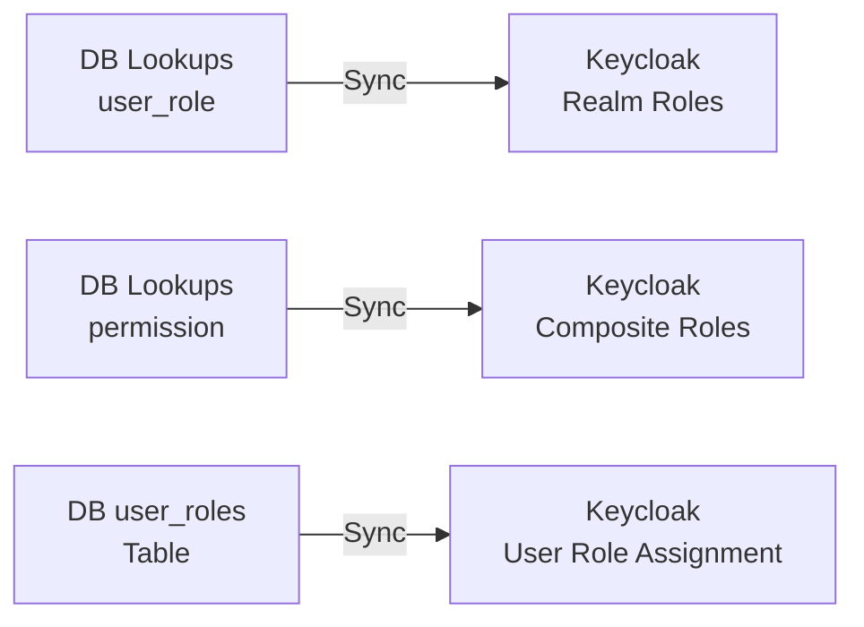

# Complete Lookups Seeder & Keycloak Synchronization Implementation

## Overview

This plan implements three major components:

1. **Comprehensive Lookup Seeder** - Add all missing lookup types and values from the PRD
2. **Keycloak Sync Seeders** - Manual scripts for bulk synchronization
3. **Keycloak Sync Services** - Automated bi-directional sync on user/role changes

## Current State Analysis

### Existing Lookups (from [`apps/backend/src/database/seeders/01-lookups.seeder.ts`](apps/backend/src/database/seeders/01-lookups.seeder.ts))

Currently only includes:

- course_level (beginner, intermediate, advanced)
- course_status (draft, published, archived)
- enrollment_status (basic values)
- payment_method (paypal, stripe, bank_transfer)
- job_type (full_time, part_time, contract, internship)
- event_type (online, in_person, hybrid)
- notification_type
- post_visibility

### Missing Lookup Types (from PRD)

According to [`leap_lms_prd.md`](leap_lms_prd.md) lines 506-542, we need to add:

- **User Management**: user_role, user_status, permission
- **Course System**: enrollment_type, enrollment_status (extended)
- **Social Features**: post_type, group_role, group_privacy, page_role, friend_request_status, reaction_type
- **Events**: event_status, event_attendance_status
- **Jobs**: experience_level, job_status, job_application_status
- **Tickets**: ticket_category, ticket_status, ticket_priority, report_type, report_status
- **Subscriptions**: subscription_status, billing_cycle, plan_feature
- **Content**: quiz_question_type, assignment_status, content_type, resource_type, message_type, message_status
- **System**: language, timezone, media_provider, visibility_type

### Keycloak Integration

Existing dependencies in [`apps/backend/package.json`](apps/backend/package.json):

- `keycloak-connect: ^25.0.6`
- `nest-keycloak-connect: ^1.10.0`

Configuration at [`apps/backend/src/config/keycloak.config.ts`](apps/backend/src/config/keycloak.config.ts)

## Implementation Plan

### Phase 1: Enhanced Lookup Seeder

**File**: [`apps/backend/src/database/seeders/01-lookups.seeder.ts`](apps/backend/src/database/seeders/01-lookups.seeder.ts)

Enhance the existing seeder with smart upsert logic:

```typescript
// Key features:
// 1. Check if lookup type exists before inserting
// 2. Check if lookup value exists before inserting
// 3. Update existing values if they differ
// 4. Support for hierarchical lookups (parent_id)
// 5. Comprehensive error handling
```

**Lookup Types to Add**:

1. **User Management**

   - `user_role`: Admin, Instructor, User/Student, Recruiter
   - `user_status`: Active, Inactive, Suspended, Banned
   - `permission`: Full CRUD permissions for each module

2. **Course System**

   - `enrollment_type`: Purchase, Subscription
   - Extend `enrollment_status`: Active, Completed, Expired, Dropped, Cancelled

3. **Social Module**

   - `post_type`: Text, Image, Video, Link, Poll
   - `group_role`: Owner, Moderator, Member
   - `group_privacy`: Public, Private, Secret
   - `page_role`: Owner, Admin, Editor, Viewer
   - `friend_request_status`: Pending, Accepted, Declined, Blocked
   - `reaction_type`: Like, Love, Celebrate, Insightful, Curious

4. **Events**

   - `event_status`: Upcoming, Ongoing, Completed, Cancelled
   - `event_attendance_status`: Going, Interested, Maybe, Not Going

5. **Jobs Module**

   - `experience_level`: Entry Level, Mid Level, Senior Level, Executive
   - `job_status`: Open, Closed, Filled, On Hold
   - `job_application_status`: Applied, Under Review, Shortlisted, Interview Scheduled, Rejected, Accepted, Withdrawn

6. **Tickets & Reports**

   - `ticket_category`: Technical, Billing, General, Content, Job Related
   - `ticket_status`: Open, In Progress, Waiting, Resolved, Closed
   - `ticket_priority`: Low, Medium, High, Urgent
   - `report_type`: Spam, Harassment, Inappropriate, Copyright, Fake Job, Other
   - `report_status`: Pending, Under Review, Resolved, Dismissed

7. **Subscriptions**

   - `subscription_status`: Active, Expired, Cancelled, Suspended, Trial
   - `billing_cycle`: Monthly, Quarterly, Annual
   - `plan_feature`: Course Access, Chat Access, Downloads, Certificates, Priority Support, Job Postings

8. **Content & Resources**

   - `quiz_question_type`: Multiple Choice, True/False, Short Answer, Essay
   - `assignment_status`: Not Submitted, Submitted, Graded
   - `content_type`: Video, Document, Quiz, Assignment, Text
   - `resource_type`: PDF, Video, Document, Link, File, Archive

9. **Chat & Messaging**

   - `chat_type`: Public, Private, Group
   - `message_type`: Text, Image, File, Voice
   - `message_status`: Sent, Delivered, Read

10. **System Configuration**

    - `language`: English (en), Arabic (ar)
    - `timezone`: UTC, Cairo, Dubai, Riyadh, etc.
    - `media_provider`: Local, MinIO, R2, S3
    - `visibility_type`: Public, Private, Friends Only, Custom
    - `payment_status`: Pending, Completed, Failed, Refunded

### Phase 2: Keycloak Admin Service

**New File**: `apps/backend/src/modules/auth/keycloak-admin.service.ts`

Create a service to interact with Keycloak Admin API:

```typescript
// Key capabilities:
// 1. Create/Update/Delete users in Keycloak
// 2. Sync user attributes (firstName, lastName, email)
// 3. Assign roles to users
// 4. Create realm roles from database roles
// 5. Manage role-permission mappings
// 6. Batch operations for bulk sync
```

**Dependencies**:

- Install `@keycloak/keycloak-admin-client` (latest version)
- Use existing `keycloak-connect` for authentication

**Service Methods**:

- `syncUserToKeycloak(userId)` - Push single user to Keycloak
- `syncAllUsersToKeycloak()` - Bulk sync all users
- `syncUserFromKeycloak(keycloakId)` - Pull user from Keycloak
- `syncRolesToKeycloak()` - Create Keycloak realm roles
- `syncPermissionsToKeycloak()` - Create permission-based roles
- `assignRolesToUser(userId, roleIds)` - Assign roles in Keycloak
- `syncUserRoles(userId)` - Sync user's role assignments

### Phase 3: Keycloak Sync Seeders

**New File**: `apps/backend/src/database/seeders/04-keycloak-roles.seeder.ts`

```typescript
// Sync all roles and permissions from database to Keycloak
// 1. Read all roles from lookups table (lookup_type = 'user_role')
// 2. Create corresponding realm roles in Keycloak
// 3. Read all permissions from lookups table
// 4. Create permission-based composite roles
// 5. Map role-permission relationships
```

**New File**: `apps/backend/src/database/seeders/05-keycloak-users.seeder.ts`

```typescript
// Bulk sync all users from database to Keycloak
// 1. Read all users from database
// 2. Check if user exists in Keycloak (by email)
// 3. Create or update user in Keycloak
// 4. Sync user attributes
// 5. Assign roles based on user.roleId and user_roles table
// 6. Handle errors gracefully (log failures, continue with others)
```

**Update**: `apps/backend/src/database/seeders/index.ts`

Add commands to run Keycloak seeders:

- `npm run seed:keycloak:roles`
- `npm run seed:keycloak:users`
- `npm run seed:keycloak:all`

### Phase 4: Automated Sync Service

**New File**: `apps/backend/src/modules/auth/keycloak-sync.service.ts`

Implements automatic bi-directional synchronization:

**Database → Keycloak (Push)**:

- Hook into user creation/update events
- Automatically sync to Keycloak when:
  - New user is registered
  - User profile is updated
  - User role is changed
  - User status is changed

**Keycloak → Database (Pull)**:

- Implement webhook receiver or polling mechanism
- Sync from Keycloak when:
  - User is created in Keycloak
  - User attributes change in Keycloak
  - Role assignments change in Keycloak

**Sync Strategy**:

- Use Redis for sync queue to prevent race conditions
- Implement retry logic for failed syncs
- Log all sync operations to audit table
- Provide conflict resolution (DB wins vs Keycloak wins)

### Phase 5: Integration with Auth Service

**Update**: [`apps/backend/src/modules/auth/auth.service.ts`](apps/backend/src/modules/auth/auth.service.ts)

Integrate Keycloak sync into existing auth flows:

**On User Registration** (line 87-132):

```typescript
async register(registerDto: RegisterDto) {
  // ... existing code to create user in DB ...
  
  // NEW: Sync to Keycloak
  await this.keycloakSyncService.syncUserToKeycloak(newUser.id);
  
  // ... rest of existing code ...
}
```

**On User Update**:

```typescript
async updateUser(userId: number, updateDto: UpdateUserDto) {
  // ... update user in DB ...
  
  // NEW: Sync to Keycloak
  await this.keycloakSyncService.syncUserToKeycloak(userId);
}
```

**On Role Assignment**:

```typescript
async assignRole(userId: number, roleId: number) {
  // ... assign role in DB (user_roles table) ...
  
  // NEW: Sync roles to Keycloak
  await this.keycloakSyncService.syncUserRoles(userId);
}
```

### Phase 6: Update Auth Module

**Update**: [`apps/backend/src/modules/auth/auth.module.ts`](apps/backend/src/modules/auth/auth.module.ts)

Add new services to providers:

- KeycloakAdminService
- KeycloakSyncService

**New File**: `apps/backend/src/modules/auth/dto/sync-keycloak.dto.ts`

DTOs for Keycloak sync operations:

- SyncUserToKeycloakDto
- SyncRolesDto
- BulkSyncUsersDto

### Phase 7: Admin API Endpoints

**Update**: [`apps/backend/src/modules/auth/auth.controller.ts`](apps/backend/src/modules/auth/auth.controller.ts)

Add admin-only endpoints:

```typescript
// Manual sync triggers for admins
@Post('admin/keycloak/sync/user/:id')
@Roles('admin')
async syncUserToKeycloak(@Param('id') userId: string)

@Post('admin/keycloak/sync/users/all')
@Roles('admin')
async syncAllUsersToKeycloak()

@Post('admin/keycloak/sync/roles')
@Roles('admin')
async syncRolesToKeycloak()

@Get('admin/keycloak/sync/status/:userId')
@Roles('admin')
async getSyncStatus(@Param('userId') userId: string)
```

### Phase 8: Configuration & Environment

**Update**: `.env` and `env.example`

Add Keycloak admin configuration:

```
KEYCLOAK_ADMIN_URL=https://keycloak.habib.cloud/admin/realms/leap-realm
KEYCLOAK_ADMIN_CLIENT_ID=admin-cli
KEYCLOAK_ADMIN_CLIENT_SECRET=your-admin-secret
KEYCLOAK_ADMIN_USERNAME=admin
KEYCLOAK_ADMIN_PASSWORD=admin
KEYCLOAK_SYNC_ENABLED=true
KEYCLOAK_SYNC_ON_CREATE=true
KEYCLOAK_SYNC_ON_UPDATE=true
```

**Update**: [`apps/backend/src/config/keycloak.config.ts`](apps/backend/src/config/keycloak.config.ts)

Add admin configuration:

```typescript
export default registerAs('keycloak', () => ({
  // ... existing config ...
  admin: {
    url: process.env.KEYCLOAK_ADMIN_URL,
    clientId: process.env.KEYCLOAK_ADMIN_CLIENT_ID,
    clientSecret: process.env.KEYCLOAK_ADMIN_CLIENT_SECRET,
    username: process.env.KEYCLOAK_ADMIN_USERNAME,
    password: process.env.KEYCLOAK_ADMIN_PASSWORD,
  },
  sync: {
    enabled: process.env.KEYCLOAK_SYNC_ENABLED === 'true',
    onCreate: process.env.KEYCLOAK_SYNC_ON_CREATE === 'true',
    onUpdate: process.env.KEYCLOAK_SYNC_ON_UPDATE === 'true',
  },
}));
```

## Data Structure & Mappings

### Role Mapping (DB → Keycloak)



### User Attribute Mapping

| Database Field | Keycloak Attribute |

|---|---|

| email | username + email |

| firstName | firstName |

| lastName | lastName |

| phone | attributes.phone |

| avatarUrl | attributes.avatar |

| preferredLanguage | attributes.locale |

| timezone | attributes.timezone |

| roleId | realm roles |

| statusId | attributes.status + enabled flag |

### Permission Structure

Permissions will be created as composite roles in Keycloak:

- `course.create` → Keycloak role
- `course.read` → Keycloak role
- `course.update` → Keycloak role
- `course.delete` → Keycloak role
- etc.

Role assignments will map to composite role membership:

- `Admin` role → includes all permissions
- `Instructor` role → includes course management permissions
- `User` role → includes basic read permissions

## Testing Strategy

### Lookup Seeder Testing

1. Run seeder on empty database
2. Verify all lookup types created
3. Verify all lookup values created with correct translations
4. Run seeder again (should be idempotent - no duplicates)
5. Manually modify a lookup value in DB
6. Run seeder again (should update the value)

### Keycloak Sync Testing

1. Start with clean Keycloak realm
2. Run role sync seeder → verify roles in Keycloak admin
3. Run user sync seeder → verify users in Keycloak admin
4. Create user via API → verify auto-sync to Keycloak
5. Update user in DB → verify changes sync to Keycloak
6. Assign role in DB → verify role assigned in Keycloak
7. Create user in Keycloak admin → verify sync to DB (if bi-directional)
8. Test sync with Keycloak offline → verify graceful error handling

## Error Handling & Edge Cases

### Seeder Edge Cases

- Duplicate codes (handle with upsert logic)
- Missing parent lookups (insert parents first)
- Database connection failures (retry with exponential backoff)
- Partial failures (log and continue)

### Keycloak Sync Edge Cases

- Keycloak server unavailable (queue for later retry)
- User already exists in Keycloak (update instead of create)
- Role doesn't exist in Keycloak (create role first)
- Email conflicts (log error, don't sync)
- Attribute type mismatches (handle type conversion)
- Sync loops (use timestamps to detect)

## Performance Considerations

### Bulk Operations

- Use batch inserts for lookups (100 at a time)
- Use Keycloak batch API for user sync
- Implement rate limiting for Keycloak API calls
- Use Redis for sync queue management
- Implement progress tracking for long-running syncs

### Database Queries

- Add indexes on frequently queried fields
- Use transactions for related operations
- Implement caching for lookup values (Redis)

## Migration Path

### For Existing Systems

1. Run enhanced lookup seeder (adds new lookups)
2. Update existing users to have proper roleId/statusId
3. Run Keycloak role sync seeder
4. Run Keycloak user sync seeder
5. Enable automated sync
6. Monitor sync logs for issues

## Documentation Requirements

### Create New Docs

- `docs/SEEDING.md` - How to run seeders
- `docs/KEYCLOAK_SYNC.md` - Keycloak sync guide
- `docs/LOOKUP_SYSTEM.md` - Lookup system usage

### Update Existing Docs

- README.md - Add seeding commands
- DEVELOPMENT_GUIDE.md - Add Keycloak setup steps

## Package Updates

```bash
# Install Keycloak Admin Client
npm install @keycloak/keycloak-admin-client --save

# Update existing packages to latest
npm update keycloak-connect nest-keycloak-connect
```

## Files to Create/Modify

### New Files (12)

1. `apps/backend/src/modules/auth/keycloak-admin.service.ts`
2. `apps/backend/src/modules/auth/keycloak-sync.service.ts`
3. `apps/backend/src/modules/auth/dto/sync-keycloak.dto.ts`
4. `apps/backend/src/database/seeders/04-keycloak-roles.seeder.ts`
5. `apps/backend/src/database/seeders/05-keycloak-users.seeder.ts`
6. `docs/SEEDING.md`
7. `docs/KEYCLOAK_SYNC.md`
8. `docs/LOOKUP_SYSTEM.md`

### Modified Files (7)

1. `apps/backend/src/database/seeders/01-lookups.seeder.ts` - Add all missing lookups
2. `apps/backend/src/database/seeders/index.ts` - Add Keycloak seeders
3. `apps/backend/src/modules/auth/auth.service.ts` - Add sync hooks
4. `apps/backend/src/modules/auth/auth.module.ts` - Add new services
5. `apps/backend/src/modules/auth/auth.controller.ts` - Add admin endpoints
6. `apps/backend/src/config/keycloak.config.ts` - Add admin config
7. `apps/backend/package.json` - Add seeder scripts

### Configuration Files

1. `.env` / `env.example` - Add Keycloak admin credentials
2. `README.md` - Add seeding instructions
3. `DEVELOPMENT_GUIDE.md` - Add Keycloak setup

## Rollback Strategy

If issues arise:

1. Disable automated sync via env variable
2. Manual sync can still be triggered via admin endpoints
3. Keycloak users can be deleted and re-synced
4. Database lookups can be reset by re-running seeder with reset flag
5. Keep audit logs for all sync operations for debugging