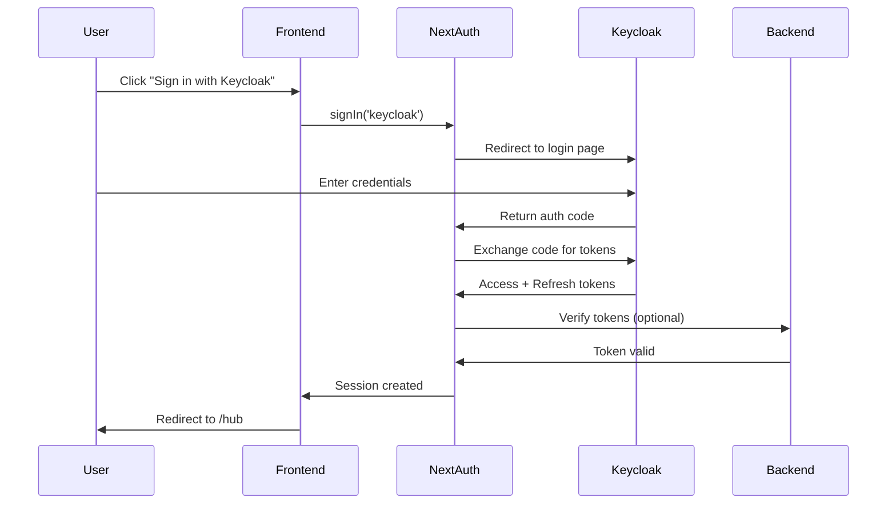
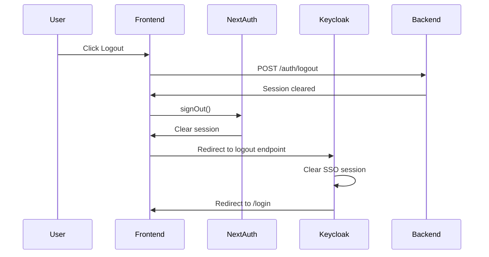

# Keycloak Frontend Authentication Guide

## Overview

All authentication in the LEAP LMS frontend is managed by Keycloak, providing:
- **Single Sign-On (SSO)** across all applications
- **Centralized user management**
- **Secure token-based authentication**
- **Automatic token refresh**
- **Complete logout from SSO**

## Authentication Flow

### Login Flow



### Logout Flow



## Implementation

### 1. Login Page

The login page (`apps/web/app/[locale]/(auth)/login/page.tsx`) uses Keycloak as the primary authentication method:

```typescript
import { signIn } from 'next-auth/react';

const handleKeycloakLogin = async () => {
  await signIn('keycloak', {
    callbackUrl: '/hub',
    redirect: true,
  });
};
```

**Features**:
- Primary button for Keycloak SSO
- Optional OAuth providers (Google, GitHub, Facebook)
- Error handling and user feedback
- Loading states during authentication

### 2. Registration Page

The registration page (`apps/web/app/[locale]/(auth)/register/page.tsx`) redirects to Keycloak's registration page:

```typescript
const handleKeycloakRegister = () => {
  const keycloakUrl = process.env.NEXT_PUBLIC_KEYCLOAK_URL;
  const realm = process.env.NEXT_PUBLIC_KEYCLOAK_REALM;
  const clientId = process.env.NEXT_PUBLIC_KEYCLOAK_CLIENT_ID_WEB;
  const redirectUri = `${window.location.origin}/api/auth/callback/keycloak`;
  
  const registrationUrl = new URL(
    `${keycloakUrl}/realms/${realm}/protocol/openid-connect/registrations`
  );
  registrationUrl.searchParams.set('client_id', clientId);
  registrationUrl.searchParams.set('response_type', 'code');
  registrationUrl.searchParams.set('scope', 'openid profile email');
  registrationUrl.searchParams.set('redirect_uri', redirectUri);
  
  window.location.href = registrationUrl.toString();
};
```

**Benefits**:
- Users register directly in Keycloak
- Consistent user data across all applications
- Keycloak handles email verification
- Password policies enforced by Keycloak

### 3. Logout Implementation

The logout functionality (`apps/web/lib/auth/keycloak-logout.ts`) ensures complete logout from both NextAuth and Keycloak:

```typescript
import { signOut } from 'next-auth/react';

export async function completeLogout(redirectTo: string = '/login') {
  // 1. Logout from backend session
  await backendLogout();
  
  // 2. Get session for ID token
  const session = await getSession();
  
  // 3. Sign out from NextAuth
  await signOut({ redirect: false });
  
  // 4. Construct Keycloak logout URL
  const logoutUrl = new URL(
    `${keycloakUrl}/realms/${realm}/protocol/openid-connect/logout`
  );
  logoutUrl.searchParams.set('post_logout_redirect_uri', redirectUri);
  logoutUrl.searchParams.set('client_id', clientId);
  
  if (session?.idToken) {
    logoutUrl.searchParams.set('id_token_hint', session.idToken);
  }
  
  // 5. Redirect to Keycloak logout
  window.location.href = logoutUrl.toString();
}
```

**Features**:
- Clears backend session cookies
- Signs out from NextAuth session
- Performs SSO logout from Keycloak
- Redirects back to application after logout
- Uses ID token hint for proper SSO logout

### 4. Logout Button Component

A reusable logout button component (`apps/web/components/ui/logout-button.tsx`):

```typescript
import { LogoutButton } from '@/components/ui/logout-button';

// Usage
<LogoutButton />
<LogoutButton variant="destructive" showIcon={false}>Sign Out</LogoutButton>
```

### 5. NextAuth Configuration

The NextAuth configuration (`apps/web/app/api/auth/[...nextauth]/route.ts`) is set up for Keycloak:

```typescript
export const authOptions: NextAuthOptions = {
  providers: [
    KeycloakProvider({
      clientId: process.env.KEYCLOAK_CLIENT_ID_WEB!,
      clientSecret: process.env.KEYCLOAK_CLIENT_SECRET_WEB!,
      issuer: process.env.KEYCLOAK_ISSUER!,
    }),
    // Other OAuth providers...
  ],
  callbacks: {
    async jwt({ token, account }) {
      if (account) {
        token.accessToken = account.access_token;
        token.refreshToken = account.refresh_token;
        token.idToken = account.id_token;
      }
      return token;
    },
    async session({ session, token }) {
      session.accessToken = token.accessToken;
      session.idToken = token.idToken;
      return session;
    },
  },
};
```

## Environment Variables

### Required Variables

```bash
# Keycloak Configuration
KEYCLOAK_ISSUER=https://keycloak.habib.cloud/realms/leap-realm
KEYCLOAK_CLIENT_ID_WEB=leap-web
KEYCLOAK_CLIENT_SECRET_WEB=your-web-client-secret

# Public Variables (accessible in browser)
NEXT_PUBLIC_KEYCLOAK_URL=https://keycloak.habib.cloud
NEXT_PUBLIC_KEYCLOAK_REALM=leap-realm
NEXT_PUBLIC_KEYCLOAK_CLIENT_ID_WEB=leap-web

# Backend API
NEXT_PUBLIC_API_URL=http://localhost:3000
```

### Optional OAuth Providers

```bash
# Google OAuth
NEXT_PUBLIC_GOOGLE_CLIENT_ID=your-google-client-id
GOOGLE_CLIENT_SECRET=your-google-client-secret

# GitHub OAuth
NEXT_PUBLIC_GITHUB_CLIENT_ID=your-github-client-id
GITHUB_CLIENT_SECRET=your-github-client-secret

# Facebook OAuth
NEXT_PUBLIC_FACEBOOK_CLIENT_ID=your-facebook-app-id
FACEBOOK_CLIENT_SECRET=your-facebook-app-secret
```

## Usage Examples

### Protecting Pages with Authentication

```typescript
// Server Component
import { getServerSession } from 'next-auth';
import { authOptions } from '@/app/api/auth/[...nextauth]/route';
import { redirect } from 'next/navigation';

export default async function ProtectedPage() {
  const session = await getServerSession(authOptions);
  
  if (!session) {
    redirect('/login');
  }
  
  return <div>Protected content for {session.user?.email}</div>;
}
```

```typescript
// Client Component
'use client';

import { useSession } from 'next-auth/react';
import { redirect } from 'next/navigation';

export default function ProtectedClientPage() {
  const { data: session, status } = useSession({
    required: true,
    onUnauthenticated() {
      redirect('/login');
    },
  });
  
  if (status === 'loading') {
    return <div>Loading...</div>;
  }
  
  return <div>Protected content</div>;
}
```

### Using Logout Button in Navbar

```typescript
import { LogoutButton } from '@/components/ui/logout-button';
import { Avatar } from '@/components/ui/avatar';
import {
  DropdownMenu,
  DropdownMenuContent,
  DropdownMenuItem,
  DropdownMenuTrigger,
} from '@/components/ui/dropdown-menu';

export function UserMenu({ user }) {
  return (
    <DropdownMenu>
      <DropdownMenuTrigger>
        <Avatar src={user.image} alt={user.name} />
      </DropdownMenuTrigger>
      <DropdownMenuContent>
        <DropdownMenuItem>
          <Link href="/profile">Profile</Link>
        </DropdownMenuItem>
        <DropdownMenuItem>
          <Link href="/settings">Settings</Link>
        </DropdownMenuItem>
        <DropdownMenuItem>
          <LogoutButton variant="ghost" />
        </DropdownMenuItem>
      </DropdownMenuContent>
    </DropdownMenu>
  );
}
```

### Checking Authentication Status

```typescript
'use client';

import { useSession } from 'next-auth/react';

export function AuthStatus() {
  const { data: session, status } = useSession();
  
  if (status === 'loading') {
    return <div>Loading...</div>;
  }
  
  if (status === 'unauthenticated') {
    return <div>Not signed in</div>;
  }
  
  return (
    <div>
      <p>Signed in as {session?.user?.email}</p>
      <p>Token expires: {new Date(session?.accessTokenExpires).toLocaleString()}</p>
    </div>
  );
}
```

## Security Considerations

### Token Management

1. **Access Tokens**: Short-lived (5-15 minutes), stored in NextAuth session
2. **Refresh Tokens**: Long-lived (30 days), used to obtain new access tokens
3. **ID Tokens**: Contains user identity information, used for SSO logout

### HTTPS in Production

Always use HTTPS in production for:
- Keycloak server
- Application frontend
- API backend

### CORS Configuration

Ensure Keycloak allows your frontend origin:

```
Valid Redirect URIs: https://your-app.com/*
Web Origins: https://your-app.com
```

### Session Security

- Sessions are HTTP-only cookies
- CSRF protection enabled
- Secure flag set in production
- SameSite policy configured

## Troubleshooting

### Login Fails

**Problem**: User gets redirected back to login after authentication

**Solutions**:
- Check Keycloak client configuration
- Verify redirect URIs match exactly
- Check browser console for errors
- Ensure NEXT_PUBLIC_ variables are set correctly

### Logout Doesn't Clear SSO Session

**Problem**: User can immediately log back in without credentials

**Solutions**:
- Ensure `id_token_hint` is passed to logout endpoint
- Check Keycloak logout endpoint URL
- Verify post-logout redirect URI is whitelisted

### Token Refresh Fails

**Problem**: User gets signed out unexpectedly

**Solutions**:
- Check refresh token expiration time
- Verify client secret is correct
- Check network connectivity to Keycloak
- Review NextAuth refresh logic

### Can't Register New Users

**Problem**: Registration button doesn't work

**Solutions**:
- Check Keycloak realm allows self-registration
- Verify registration endpoint URL
- Check redirect URI is whitelisted
- Review browser console for errors

## Best Practices

1. **Always use Keycloak for authentication** - Never implement custom login forms
2. **Handle token refresh automatically** - Use NextAuth's built-in refresh mechanism
3. **Logout properly** - Always perform SSO logout, not just local session clear
4. **Validate tokens on backend** - Don't trust tokens without verification
5. **Use HTTPS everywhere** - Especially in production
6. **Monitor token expiration** - Refresh proactively before expiration
7. **Handle errors gracefully** - Provide user-friendly error messages
8. **Test logout flow** - Ensure complete SSO logout works correctly
9. **Keep secrets secure** - Never expose client secrets in frontend code
10. **Update dependencies** - Keep NextAuth and related packages updated

## Migration from Local Auth

If migrating from local authentication:

1. Update all login forms to use Keycloak
2. Remove local credentials provider (or make it optional)
3. Migrate existing users to Keycloak
4. Update all logout buttons to use `completeLogout()`
5. Test all authentication flows thoroughly
6. Update documentation and user guides

## Additional Resources

- [Keycloak Documentation](https://www.keycloak.org/documentation)
- [NextAuth.js Keycloak Provider](https://next-auth.js.org/providers/keycloak)
- [OIDC Specification](https://openid.net/connect/)
- [Token Verification Guide](./TOKEN_VERIFICATION_GUIDE.md)
